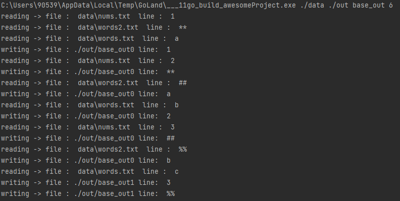

# Goroutines-Concurency-Merge-Multiple-Files
A simple script to merge files concurently in a path with max_line count. When max_line count was reached another output file will be created. 

Your CPUs should be performing both read and write operations at the same time. For
example once row_1 of file_input_1 is read and available in RAM script should be able to
do all of these three at the same time (or at least seemingly at the same time):

- Write row_1 to file_output_1
- Read row_2 from file_input_1
- Read row_index_X from file_input_Y

## Running Time Enviroments
arg1= input path, arg2= output path, arg3= output files base name, arg4= max_line count

## Build and Compile
```bash
$ go build
$ go run main.go arg1 arg2 arg3 arg4
```
Example: 
```bash
$ go build
$ go run main.go ./data ./out base_out 4
```
## Example of Execution Time


